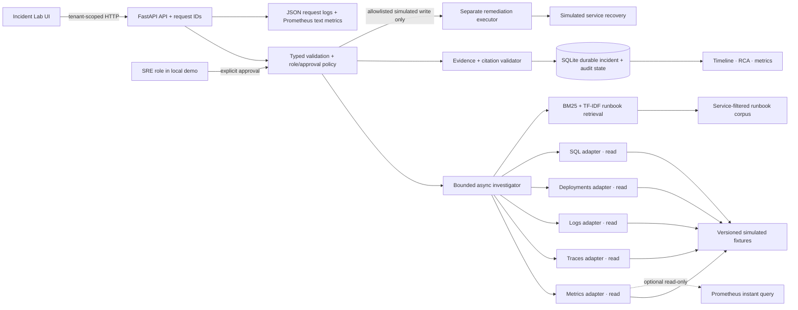

# Architecture and trust boundaries

## Boundaries and failure behavior

- The browser calls the FastAPI API. `X-Tenant-ID` scopes local demo records; the app validates its syntax and includes the tenant in every incident lookup. The demo selector is not authentication: deployment behind a real identity provider is required before connecting customer tenants.
- The investigator makes a fixed sequence of five typed read-only adapter calls, then one service-filtered runbook lookup. Metrics can use one operator-configured Prometheus instant query; the other four sources remain versioned fixtures. The PromQL expression and endpoint are not accepted from incident requests. It has no free-form tool loop, model call, or ability to issue SQL writes. Each call, result, failure, request ID, incident ID, and run ID is persisted.
- The displayed confidence is a deterministic rule score (0.96 with all sources; 0.82 when optional sources fail), not a calibrated probability.
- Scenario fixtures and runbooks are simulated. Prometheus observations are labeled separately. Retrieved runbooks are labeled untrusted guidance. The deterministic investigator derives causes only from versioned ground truth and validates that every required source is present; any mixture of live and simulated evidence blocks the scenario-specific cause and remediation.
- SQLite is durable local state. The investigation task set and chaos settings are process memory; interrupted investigations are marked blocked on restart. There is no queue, Redis, PostgreSQL, or multi-worker coordination in this local build.
- A separate executor accepts only three allowlisted simulated actions after an SRE approval request. It changes the simulated incident state; it cannot connect to a real service.
- JSON request logs correlate request IDs. Tool records add incident/run/tool-call IDs. `/api/metrics` exposes local Prometheus-format counters and measured latency. There is no OpenTelemetry collector or Grafana deployment.
- The default demo has no external API, model, font, or cloud dependency. The optional Prometheus adapter uses a bounded HTTP client and bearer token from environment variables. Docker Compose is optional packaging; the API and static UI also run directly on Python.

## Simplicity decisions

The local portfolio lab uses SQLite instead of PostgreSQL, an in-process task instead of a broker, and a deterministic bounded state sequence instead of LangGraph. These remove infrastructure that the four-person deterministic demo does not need. BM25 plus sparse TF-IDF provides a reproducible hybrid lexical baseline; it is not semantic embedding retrieval. The modules can be replaced behind their current schemas if measured load or quality makes those upgrades useful.
